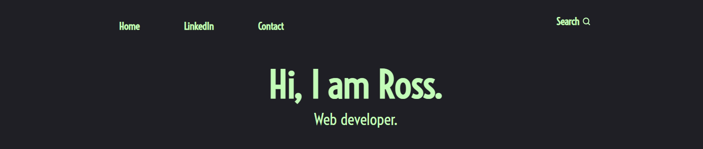

# LINKS

 
<h1 align="center">Ross's Tech Blog</h1>

# A blog for documenting my encounters in learning software development ⭐

Currently at an MVP stage of development.

### Deployed site ✅

[Website hosted on Render](https://rosscraigblog.onrender.com/)

### Built with ⚡

-  Node.js
-  Express.js
-  CSS
-  React
-  MongoDB and Mongoose ODM
-  Node
-  Render
-  JSON Web Tokens

## Some available Scripts 🧬

In the root of the project directory, you can run:

### `npm install`
Install dependencies for both server and client 

### `npm run develop`

Runs just the client and server app using concurrently in development mode. 
Open [http://localhost:3000](http://localhost:3000) to view the client in the browser.

## Motivation 🌻

### Contributors 👨‍💻

- Ross Thomson | https://github.com/rthomson412

### Screenshots

